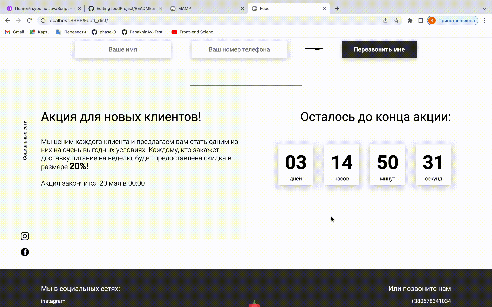

# Сайт по продаже здорового питания "foodProject"
## foodProject - это сайт по подбору здорового питания исходя из особенностей каждого отдельного заказчика
## Стэк - JS, HTML, CSS. 
### Разработчик:
- [Ригина П.](https://github.com/riginapapakhina)

Сайт создан в рамках работы над заданиями курса Ивана Петриченко ["Полный курс по JavaScript + React - с нуля до результата"](https://www.udemy.com/course/javascript_full/)

### Приложение позволяет:
- Запросить и получить контактные данные клиента
- Произвести рассчет суточной нормы калорий
- Оповестить клиента о времени окончания акции в режиме реального времени

## Возможности сайта
### `Получение контактной информации пользователя`
Каждый пользователь может ввести свои данные в форму обратной связи. Данные будут переданы на сервер. Форма открывается как при нажатии на кнопку "Связаться", так и при длительном прибывании на сайте

#
### `Ознакомление пользователя с меню`
При выборе той или иной вкладки пользователю будут показаны различные стили притяния

#
### `Дополнительный блок со слайдером`
Этот слайдер используется на сайте для демонстрации временно и легко может быть использован в дальнейшем под отображение отзывов довольных клиентов, которые появятся в будущем.

#
### `Рассчет калорий пользователя`
Этот калькулятор калорий построен на осонве реальной таблицы данных по требуемой суточной норме потребления калорий у мужчин и женщин. Пользователь вводит свои параметры и получает количество калорий. 

ВАЖНО! Если пользователь указывает данные неверно,то поле подсвечивается красным и рассчет не происходит

#
### `Обратный отсчет до завершения акции`
Этот модуль позволяет показать клиенту, какое количество времени осталось до окончания действия персональной скидки.

#
## Выполненная работа:
- Придание динамичности табам на странице (без использования библиотек)
- Создание таймера обратного отсчета
- Создание всплывающего модального окна
- Шаблонизация карточек меню ("Постное", "Премиум", "Фитнес")
- Реализация скрипта отправки данных из модального окна на сервер
- Создание слайдера и калькулятора калорий
- Сборка проекта с Webpack
